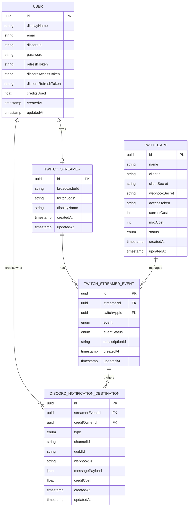

# Entity Relationship Diagram

---

## Enum-значення

### `TwitchApp.status`
| Значення | Опис |
|---------|------|
| `ACTIVE` | Додаток активний, приймає підписки |
| `INACTIVE` | Виведений з обігу |

### `TwitchStreamerEvent.event`
| Значення | Twitch EventSub тип |
|---------|-------------------|
| `STREAM_ONLINE` | `stream.online` |
| `STREAM_OFFLINE` | `stream.offline` |
| `CHANNEL_UPDATE` | `channel.update` |
| `CHANNEL_RAID` | `channel.raid` |
| `CHANNEL_SUBSCRIBE` | `channel.subscribe` |
| `CHANNEL_CHEER` | `channel.cheer` |

### `TwitchStreamerEvent.eventStatus`
| Значення | Опис |
|---------|------|
| `PENDING` | Підписка зареєстрована, очікує верифікації |
| `VERIFIED` | Twitch підтвердив підписку (webhook challenge пройдено) |
| `REVOKED` | Twitch скасував підписку (токен прострочений / app змінено) |

### `DiscordNotificationDestination.type`
| Значення | Механізм доставки |
|---------|-----------------|
| `DISCORD_BOT` | Відправка через Discord Bot в канал (`channelId` + `guildId`) |
| `DISCORD_WEBHOOK` | Відправка через Discord Incoming Webhook (`webhookUrl`) |
