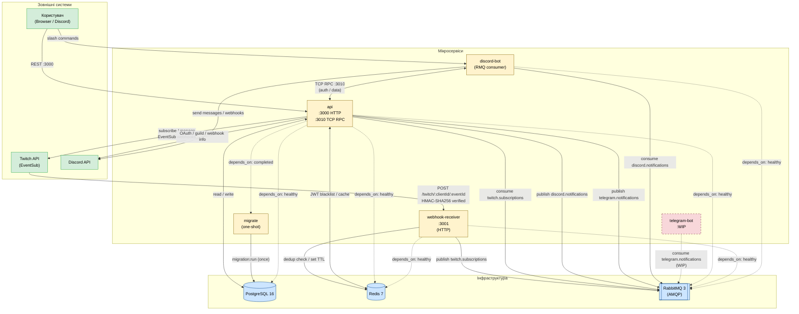
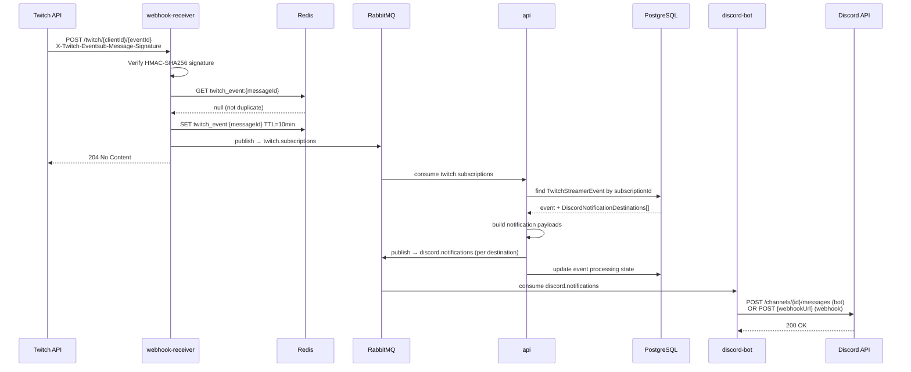
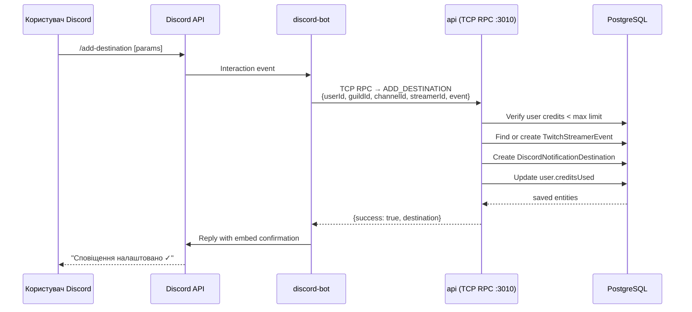
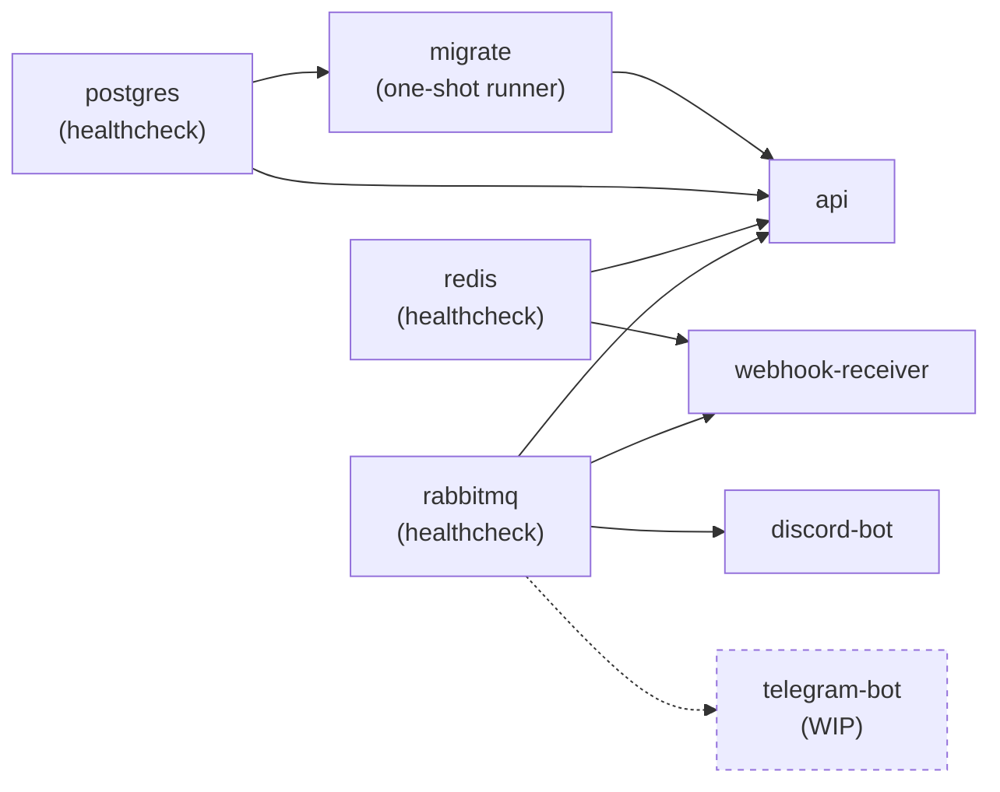

# Service Dependency & Data Flow Diagram

## Залежності між сервісами

---

## Потік даних: Stream Online подія (end-to-end)

---

## Потік даних: Додавання Discord-призначення через slash-команду

---

## Docker Compose: порядок запуску

